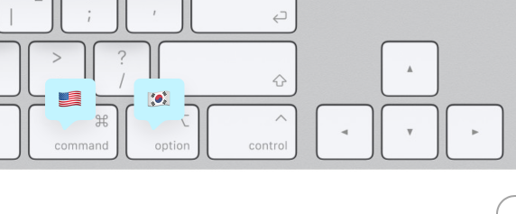

# 🎏 LangKeys

https://github.com/user-attachments/assets/e6bf3f73-97b2-4fe5-a6be-6321ff793f76

Tap a modifier key **on its own** to switch keyboard input source. Hold it as part of a shortcut
(⌘C, ⌥←) and nothing happens.



Out of the box, Right ⌘ and Right ⌥ map to your first two input sources. A flag pops out of the
notch on each switch.

## Install

```sh
./build.sh --install     # build, copy to /Applications, launch
```

Then grant **System Settings → Privacy & Security → Accessibility → LangKeys**. The app polls
every two seconds, so it starts working as soon as the toggle flips.

Ad-hoc signed builds lose that grant whenever the binary changes, so expect to re-approve after a
rebuild.

## Use

The menu bar shows the current input source's flag. Clicking it gives you a row per modifier key
(Right/Left ⌘ ⌥ ⇧ ⌃ and Fn) with a submenu of your enabled input sources, plus **Enabled**,
**Show Flag in Notch**, **Open at Login**, and **Settings…** (⌘,).

Settings has three tabs: **Keys** (mappings and notch side), **Notch** (flag on/off, stay visible
or auto-hide after 0.5–6s), **General** (pause, hide menu bar icon, login item, quit).

The menu bar icon can be hidden entirely — relaunch LangKeys from Spotlight to reopen settings.

## Languages

LangKeys has no language list of its own — it picks up whatever you enable in **System Settings →
Keyboard → Input Sources**, and works out the flag from the input source's language. That covers
every one of the 135 languages macOS ships a keyboard for:

| | | | |
|---|---|---|---|
| 🇯🇵 Ainu | 🇫🇷 French | 🇱🇹 Lithuanian | 🇮🇳 Sanskrit |
| 🇬🇭 Akan | 🇬🇳 Fula | 🇸🇪 Lule Sami | 🇮🇳 Santali |
| 🇦🇱 Albanian | 🇬🇪 Georgian | 🇺🇸 Lushootseed | 🇷🇸 Serbian |
| 🇪🇹 Amharic | 🇩🇪 German | 🇲🇰 Macedonian | 🇵🇰 Sindhi |
| 🇺🇸 Apache, Western | 🇬🇷 Greek | 🇮🇳 Maithili | 🇱🇰 Sinhala |
| 🇸🇦 Arabic | 🇮🇳 Gujarati | 🇲🇾 Malay | 🇫🇮 Skolt Sami |
| 🇦🇲 Armenian | 🇭🇹 Haitian Creole | 🇮🇳 Malayalam | 🇸🇰 Slovak |
| 🇮🇳 Assamese | 🇳🇬 Hausa | 🇲🇹 Maltese | 🇸🇮 Slovenian |
| 🇮🇶 Assyrian | 🇺🇸 Hawaiian | 🇮🇶 Mandaic | 🇸🇪 South Sámi |
| 🇦🇿 Azerbaijani | 🇮🇱 Hebrew | 🇮🇳 Manipuri | 🇪🇸 Spanish |
| 🇧🇩 Bangla | 🇮🇳 Hindi | 🇳🇿 Māori | 🇸🇪 Swedish |
| 🇧🇾 Belarusian | 🇨🇳 Hmong | 🇮🇳 Marathi | 🇹🇯 Tajik |
| 🇮🇳 Bodo | 🇭🇺 Hungarian | 🇨🇦 Mi’kmaw | 🇲🇦 Tamazight |
| 🇧🇬 Bulgarian | 🇮🇸 Icelandic | 🇲🇳 Mongolian | 🇮🇳 Tamil |
| 🇲🇲 Burmese | 🇳🇬 Igbo | 🇺🇸 Mvskoke | 🇮🇳 Telugu |
| 🇭🇰 Cantonese | 🇫🇮 Inari Sami | 🇬🇳 N’Ko | 🇹🇭 Thai |
| 🇺🇸 Cherokee | 🇷🇺 Ingush | 🇺🇸 Navajo | 🇨🇳 Tibetan |
| 🇺🇸 Chickasaw | 🇨🇦 Inuktitut | 🇳🇵 Nepali | 🇹🇴 Tongan |
| 🇨🇳 Chinese (Simplified) | 🇮🇪 Irish | 🇺🇸 Nez Perce | 🇹🇷 Turkish |
| 🇹🇼 Chinese (Traditional) | 🇮🇹 Italian | 🇳🇴 North Sámi | 🇹🇲 Turkmen |
| 🇺🇸 Chochenyo | 🇯🇵 Japanese | 🇳🇴 Norwegian Bokmål | 🇺🇦 Ukrainian |
| 🇺🇸 Choctaw | 🇩🇿 Kabyle | 🇮🇳 Odia | 🇸🇪 Ume Sámi |
| 🇷🇺 Chuvash | 🇮🇳 Kannada | 🇺🇸 Osage | 🇵🇰 Urdu |
| 🇭🇷 Croatian | 🇮🇳 Kashmiri | 🇦🇫 Pashto | 🇨🇳 Uyghur |
| 🇨🇿 Czech | 🇰🇿 Kazakh | 🇮🇷 Persian | 🇺🇿 Uzbek |
| 🇩🇰 Danish | 🇰🇭 Khmer | 🇸🇪 Pite Sámi | 🇦🇫 Uzbek (Afghan) |
| 🇲🇻 Dhivehi | 🇷🇺 Kildin Sámi | 🇵🇱 Polish | 🇻🇳 Vietnamese |
| 🇮🇳 Dogri | 🇮🇳 Konkani | 🇧🇷 Portuguese | 🇮🇳 Wancho |
| 🇳🇱 Dutch | 🇰🇷 Korean | 🇮🇳 Punjabi | 🇬🇧 Welsh |
| 🇧🇹 Dzongkha | 🇹🇷 Kurdish | 🇮🇩 Rejang | 🇲🇽 Wixárika |
| 🇺🇸 English | 🇮🇶 Kurdish (Sorani) | 🇲🇲 Rohingya | 🇨🇦 Wolastoqey |
| 🇪🇪 Estonian | 🇰🇬 Kyrgyz | 🇷🇴 Romanian | 🇮🇱 Yiddish |
| 🇫🇴 Faroese | 🇱🇦 Lao | 🇷🇺 Russian | 🇳🇬 Yoruba |
| 🇫🇮 Finnish | 🇱🇻 Latvian | 🇼🇸 Samoan | |

Flags come from the language's most likely region, so 🇺🇸 covers `en` and 🇧🇷 covers `pt` unless the
input source names a region of its own (British is 🇬🇧, Canadian French is 🇨🇦). A language with no
sensible flag falls back to a two-letter badge — Unicode Hex Input, which belongs to no language,
shows `UN`.

Every layout for a language shares that language's flag: 2-Set Korean, 3-Set Korean, and
GongjinCheong Romaja are all 🇰🇷, and you can map any of them to a key. Only nine input sources can
be mapped at once, one per modifier key.

## Build options

```sh
./build.sh               # just build build/LangKeys.app
./build.sh --dmg         # ad-hoc signed DMG, for your own machines
./build.sh --release     # Developer ID + notarized DMG, for handing to other people
```

Builds are universal (arm64 + x86_64) when full Xcode is installed. With only the Command Line
Tools there's no `xcbuild`, so the script builds for this machine's own architecture instead —
fine for `--install` and `--dmg` on your own Macs, and `--release` warns that the DMG won't run
elsewhere.

`--release` reads App Store Connect credentials from a gitignored `.env` (see `.env.example`):
`APPLE_API_KEY` (path or key contents), `APPLE_API_KEY_ID`, `APPLE_API_ISSUER`, `APPLE_TEAM_ID`.
It notarizes in two passes — app first, then the DMG built from the stapled app — so the app still
launches when copied out and first run offline.

## How it works

`EventTapController` installs a listen-only `CGEvent` tap on `flagsChanged`, `keyDown`, and mouse
downs. Left and right keys are tracked separately via each key's device-dependent flag bit. A
pending modifier is discarded the moment any other key, click, or second modifier arrives; only a
clean press→release fires `TISSelectInputSource`. The tap never delays or swallows keystrokes, and
re-arms itself if macOS disables it.

Preview the notch HUD without pressing anything:

```sh
./build/LangKeys.app/Contents/MacOS/LangKeys --preview-notch
```

Window and notch geometry (`NotchShape`, `NotchGeometry`, `NotchPanel`) are adapted from
[TheBoredTeam/boring.notch](https://github.com/TheBoredTeam/boring.notch), itself drawing on
[DynamicNotchKit](https://github.com/MrKai77/DynamicNotchKit).

## Notes

- Swap the app icon for any emoji: `swift scripts/make-icon.swift 🐙 && ./build.sh --install`
- Mappings live in `UserDefaults` under `so.dou.langkeys`.
- Requires macOS 13+.
